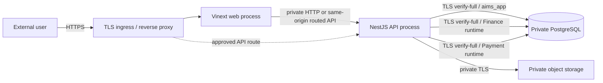
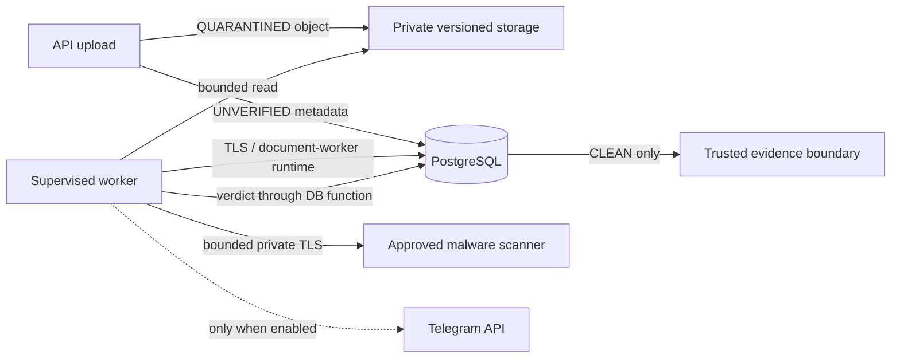
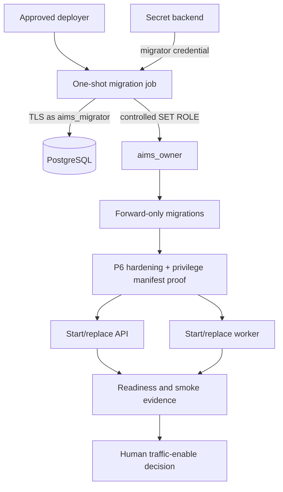
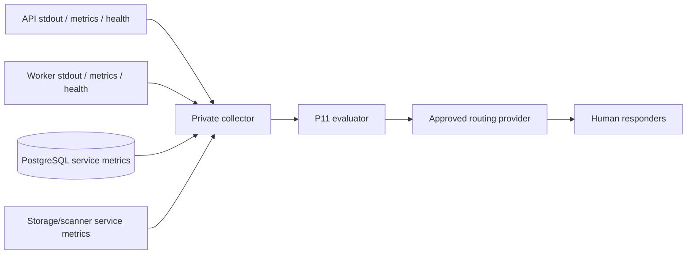
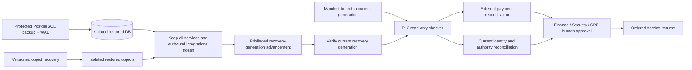

# AIMS P13 Provider-Neutral Production Topology

This is a decision model, not deployed infrastructure. Provider names, domains,
regions, replicas and numeric capacity are intentionally unresolved.

## Request and API path

Only ingress is public. Prefer a same-origin product surface; use a distinct API
hostname only if the chosen platform requires it and cookie/Origin/CORS policy is
explicitly verified. Health and metrics are management surfaces, not public
product endpoints.

## Worker and document path

The worker may scale horizontally because database leases serialize claims.
Redis and a scheduler are not required. Transfer or scanner success alone never
grants trust; PostgreSQL remains authoritative.

## Database trust and deployment path

`aims_owner` and executor roles remain NOLOGIN. Runtime roles cannot perform
migrations. Infrastructure administrators receive no AIMS Finance authority.

## Network trust zones

| Zone | Inbound | Outbound | Public? |
| --- | --- | --- | --- |
| Public ingress | 443; 80 redirect only | Web/API private endpoints | Yes |
| Web/application | Ingress only | API, telemetry | No |
| API | Ingress/web only | PostgreSQL, storage, scanner, IdP, telemetry; AI/Telegram only when enabled | No |
| Worker | Supervisor/management only | PostgreSQL, storage, scanner, telemetry; Telegram only when enabled | No |
| Database | API, worker and migration network identities | Backup/monitoring service | No |
| Management/deployment | Approved CI/deploy/DBA operators | platform, migration, evidence stores | No |

Use deny-by-default network and egress policy where supported. Exact addresses,
firewall products and ports beyond HTTPS/PostgreSQL are provider decisions.

## Observability path

Telemetry is non-authoritative and must contain no secrets, bank references,
document content or unbounded identifiers. Alerts request human attention and
cannot mutate AIMS.

## Disaster-recovery path

The database and object recovery points must be mutually reconcilable. Latest
object version alone is insufficient. Restored generation G1 can contain stale
sessions, Approval/Telegram authority and worker/outbox claims, so an authorized
operator advances to G2 and verifies it while every service remains frozen. The
read-only checker neither advances generation nor repairs state. External
payment reality and current organizational authority are reconciled manually
after technical verification; only Finance/Security/SRE human approval permits
ordered resume. P12 recovery is not deployment rollback.
